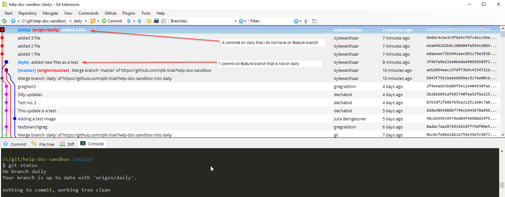
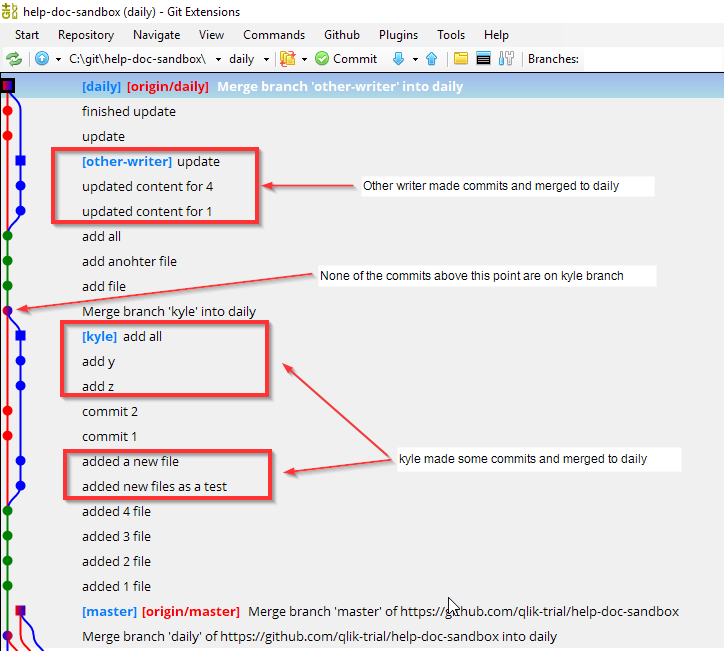

# A complete workflow

The other topics should have given you a good foundation for running some of the many git processes in Git Bash and Git Extension. This topic will cover a more highlevel workflow without going too much into the small details which are covered in other topics. When referring to git actions, I will use the command name (ex. `git merge`), but you can do the action with the Git Extensions.

!!! Info
    ** marks a step that pulls content from the remote to your local branch. Pay attention to when you should run `git pull`.

!!! Note
    This workflow does not necessarily reflect our current workflow, but it does cover all of the git commands you'll need to know for your daily work. **In this tutorial pay attention to what happens where, and why it happens.**

## Create a local branch

You create branches to isolate work. When you create a branch, it exists on your machine only. I refer to these branches as _local_ branches because they are local to you. You should not run `git push` or `git pull` on local branches, since these commands interface between your local repo and the remote repo.

### Naming

* feature/HLP-XXXX

* feature/PS-XXXX

* bug/HLP-XXXX

* cleanup/name

### Scenario

You want to create a branch.

1. `git checkout daily`

1. `git pull` **

1. `git branch branch-name` (creates a branch) ... OR ...

    `git checkout -b branch-name` (creates and checkouts branch)

## Commit your work

Committing means adding content to a repository. When you are on a branch, you modify files, you stage the modifications, then you commit those modifications to the local repository.

### Scenario

You edit some files in Flare.

1. `git status` (to list the modified files that are in the working area)

1. `git add <file-name>` ... OR ...

1. `git add --all` (adds all files in the working area)

1. `git commit -m "a good commit message"`

## Merge your branch

Merging means bringing the commit history from one branch into another branch. We merge local branches into shared branches.

### Scenario

You want to merge your local branch to `daily`.

1. `git checkout daily`

1. `git pull` **

1. `git merge <feature-branch>`

## Keeping in sync

Keeping in sync means making sure that your local copies of the `master` and `daily` branches have the latest content. Whenever you checkout a shared branch (`master` or `daily`), you _must_ run `git pull` first.

### Scenarios

#### You want to merge your feature with `daily` so you can check the output with Jenkins

1. `git checkout daily`

1. `git pull` **

1. `git merge feature/branch`

1. `git push` **

#### You want to cherry-pick your feature to `master`

1. `git checkout master`

1. `git pull` **

1. `git merge --squash feature/branch`

1. `git add <file-name>` ... OR ...

1. `git add --all` (adds all files in the working area)

1. `git commit -m "a good commit message"`

1. `git push` **

#### You have a long running feature. You want to update your local branch with new content from `daily`

How do we sync our _local_ branch with a remote branch?

!!! Tip
    The `git pull` step is very important here. If you rebase a daily that is not up-to-date, you'll get into trouble later on.



1. `git checkout daily`

1. `git pull` **

1. `git checkout feature/branch`

1. `git rebase daily`


!!! Tip
    Compare the two graph images. Notice what happens when you rebase `daily` _onto_ your feature branch. Git _rewinds_ the head of your feature branch, then adds the commits from daily and then places your commit at the top.

#### More complex example

Rebasing daily onto your local branch works even when there are more than one branches involved. The image below shows a likely scenario:

* Some other writer has a local branch and they are merging to `daily`.

* The `daily` branch has commits on it that are not part of your local branch.

* You are working on a local branch and have been merging to `daily`.

!!! Tip
    Don't necessarily rebase all the time. I would restrict this to times when you know there is work that you need to grab from daily that was added after you branched off of `daily`, or when you are working with another writer on a feature/area.

!!! Warning
    Pay attention to what you are doing! Do not rebase onto shared branches. This increases the risk of having unwanted merge conflicts. Before rebasing, make sure you know what branch you have checked out.



1. `git checkout daily`

1. `git pull` **

1. `git checkout feature/branch`

1. `git rebase daily`

The result is the image below. Note that `daily` and `kyle` point to the same commit which shows you that `kyle` has all of the content from the two parents: 1 from the running `daily` branch and the other from `other-writer`.


### Summary

* Use `git pull` whenever you interact with a shared branch. Even if you _think_ there is nothing new, get into the habit of pulling often. This is how you grab other writers work _before_ you create a branch.

* Use `git merge` to add content from your feature branch into `daily`. Do this when you want to see the build output from Jenkins. Once you merge into `daily`, other writers can see this content.

* Use `git rebase` when you need to grab _newer_ content from `daily` to bring it into your feature branch. This is how you manage to keep your local branch content from diverging too much from the `daily` branch. This is probably not required for short lived features or if the area you are working in is not changing often.

## Build in Jenkins

To build the output, Jenkins looks at the `daily` branch on github.com. The Jenkins build environment asks you to select the product to build, which area or areas of that product's help site, and the branch to build from. The `daily` branch is what you will build most often.

## Squash and cherry-pick

The `master` branch is a _clean_ branch that we use to create release branches. This branch contains complete work that can be included in a release. 

We want to avoid having a messy commit history on `master` by cherry-picking features, bugs, and cleanup work, onto `master`.

Think of it like this:

* A merge commit results in a history of at least 2 commits:

    * 1 merge commit (E).

    * 1 commit from the branch being merged (B).

    ```ASCII
        B
         \
    C--D--E (daily)
    ```

* If the branch has many commits, then the number of commits in the branch history will be the number of commits + 1 merge commit.

* If 14 writers merge 14 branches with 6 commits on each branch, then the commit history for 14 branches (maybe 14 features) results in 98 commits (14branches *7commits).

### Two git actions

#### Squash

This means to take 1+ commits and turn them into a single commit. A squash changes commits, therefore git is rewriting history.

#### Cherry-pick

This means to take a single commit and add it to the tip of a branch without making a merge commit.

### Scenario

You have tested your feature on the `daily` branch + Jenkins build. No more work needs to be done.

1. `git checkout master`

1. `git pull` **

1. `git merge --squash <feature-branch>`

    This command does not do a merge commit. The `--squash` option takes all of the modified files from all of the commits on the branch and puts them into the working area on `master`.

1. `git add --all`

1. `git commit -m "Squash + cherry-pick feature-xxxx to master"`

1. `git push`

## Writer's checklist

The writer's checklist refers to the steps from start to finish. A feature is finished when the feature has been cherry-picked to `master` and the local branch is deleted. You should have a checklist whenever you create a new branch.

### Example checklist

For each feature/bug/documentation task:

1. I create a branch from `daily`.

1. I label the branch according to the naming convention.

1. I make sure that I have my branch checked out.

1. I do my work and commit my work to my local branch.

1. I merge my branch to daily, I push daily to the remote, I run a build from Jenkins.

1. When my work is finished, I make sure my branch is merged to daily.

1. I squash my commits into a single commit.

1. I cherry-pick that single commit to `master`.

1. I delete my local branch.