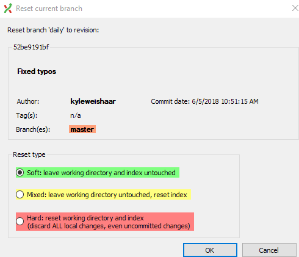

# Reset a Commit with Git Extension

??? Warning
    Git Reset (delete) is a destructive process, and by this I mean that git reset changes the history of a branch and when you change histories you increase the chances of having problematic merges between branches. Only reset a commit if it is absolutely necessary.</br>Instead, use [Git Revert](revert-gitExt.md).

There may be times when you need to reset (delete) a commit, but this should be a last-resort operation. However, reset is also the function we use to squash commits, so some of this content might be familiar. This topic covers deleted commits rather than squashing them.

There are three options:

|Reset |Description|
|---    |---        |
|Soft   |Reverts branch to previous commit and keeps the file(s) in the index.|
|Mixed |Reverts branch to previous commit and unstages the file(s).|
|Hard   |Reverts branch to previous commit and deletes any changes associated with the deleted commit.|

!!!Tip
    You most always want to do a soft or mixed reset.

To reset commits, do the following:

1. Right-click the parent of the commit you want to delete and select **Reset current branch to here**.

    A dialog opens.

    

1. Select one of the options.

1. Click **OK**.

## Reset options

If you select **Soft**:

* Files are re-_staged_ (they are kept in the index)

If you select **Mixed**:

* Files are _unstaged_(they are kept in the working area)

If you select **Hard**:

* Files and changes are deleted and no pending changes remain.(the commit and files are deleted)

## Difference between Git Reset and Git Revert

### Git Reset

* Destructive process
* Costly mistakes
* History is lost

```ascii
A--B--C
git reset (delete C)
A--B
```

### Git Revert

* Safe process
* Keeps commit history
* Reverse the commit by creating a new commit

```ascii
A--B--C
git revert (reverse C by committing D)
A--B--C--D
```