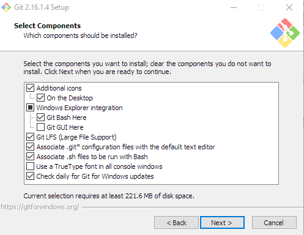

# Get Git

To get set up with Git, you need to download Git and Git Extension.

!!! Tip
    If you plan to install Git Extension, you can install Git with the Git Extensions installer.

## Git

You can download Git from the [Git Download](https://git-scm.com/download/win) site.

The installer includes:

- Git
- Git bash (CLI for Git)

???Info
    When requesting access to qlik-trial, please follow these [instructions](https://confluence.qliktech.com/pages/viewpage.action?spaceKey=QE&postingDay=2018%2F2%2F1&title=Okta+authentication+for+GitHub).

### Components to include during setup

You can include Git Desktop if you select **Git GUI Here**.

We recommend that you use Git Extension instead.

## Git Extension

Follow the instructions to install Git Extension.

[Git Extension](gitExt-install.md)

## Next steps

Once you have the tools installed on your machine, you should clone the omni-project repository to your machine.

 * [Get started by cloning the repository with Git Extension](get-code.md)
    - Use Git Extension to clone the omni-project repository to your local machine.

* [Get started by cloning the repository with Git Bash](get-code-cli.md)
    - Use Git Bash to clone the omni-project repository to your local machine.