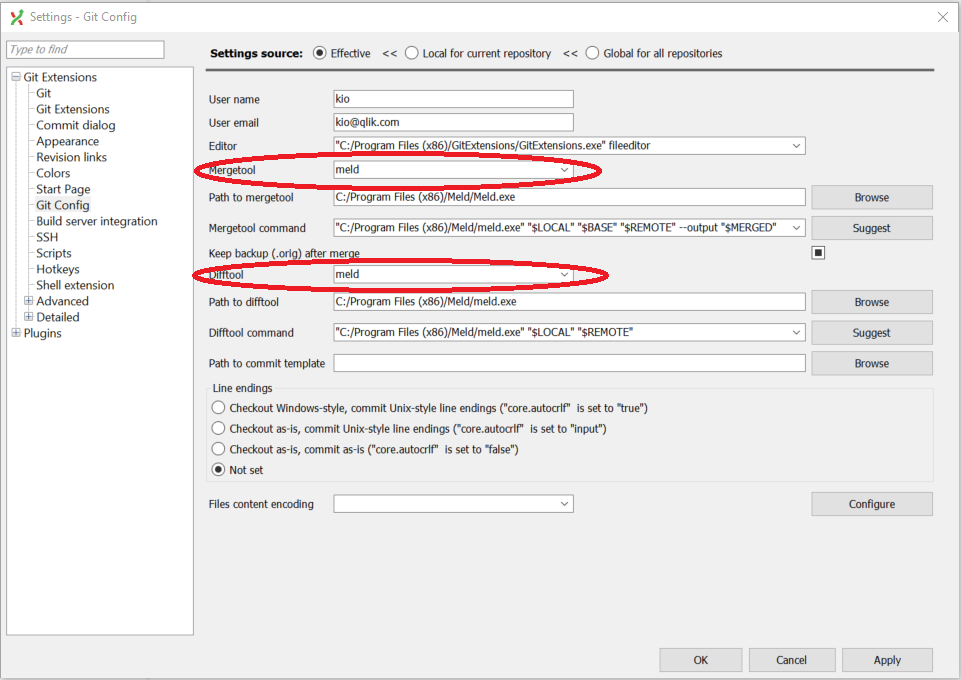
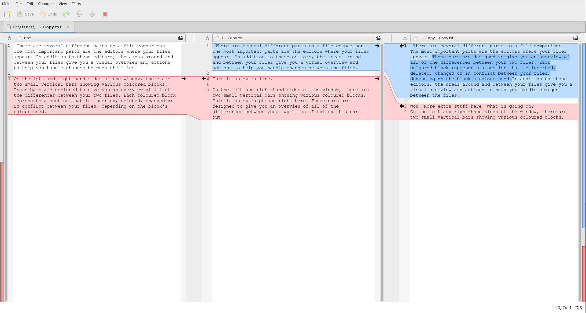

# Meld

Meld is a visual diff and merge tool. If you don't like KDiff, you can add Meld to Git Extension to use as the default merge tool.

## Installing Meld

1. Go [here](http://meldmerge.org/) to download and install the latest version of meld.

1. In Git Extensions, select **Tools** > **Settings**.

1. Under **Git Config** > **Mergetool**, select `meld` from the drop-down menu.

1. Repeat these steps for **Difftool** on the same page.

The configuration should look like this:

1. Click **Apply**.

1. Click **Ok**.

## Using Meld

When a conflict occurs, Git Extensions suggests that you solve the conflict. The tools that Git Extensions will use to resolve the conflict is Meld.

### Understanding colors

|Color | Indicates|
|---    |---    |
|Red| Lines are in conflict|
|Blue|Resolved conflict lines|
|Green|Line modifications that are not in conflict|

Clicking on an arrow will grab the colored content and “push” it to that direction. It will replace the content in the destination file. This is the default functionality. (In the example below I clicked on the first arrow on the file located on the right, replacing the content in the file in the middle).

Hold Ctrl to turn the arrows into + signs. This adds the content in the destination file, either above or below the current content.

Hold Shift to turn the arrows into x signs. This deletes the content in the file.

Learn more at http://meldmerge.org/help/file-mode.html
