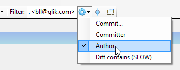
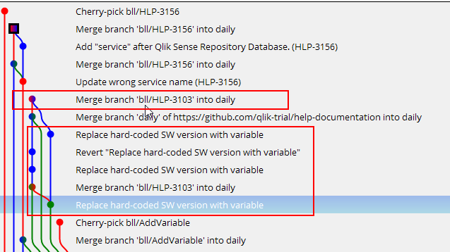
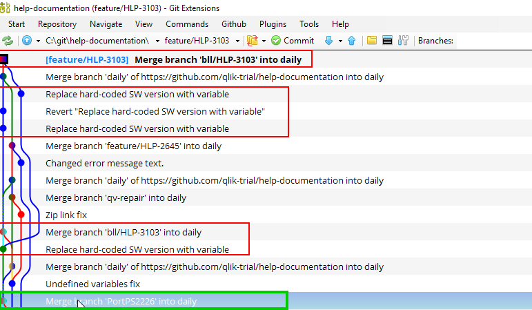
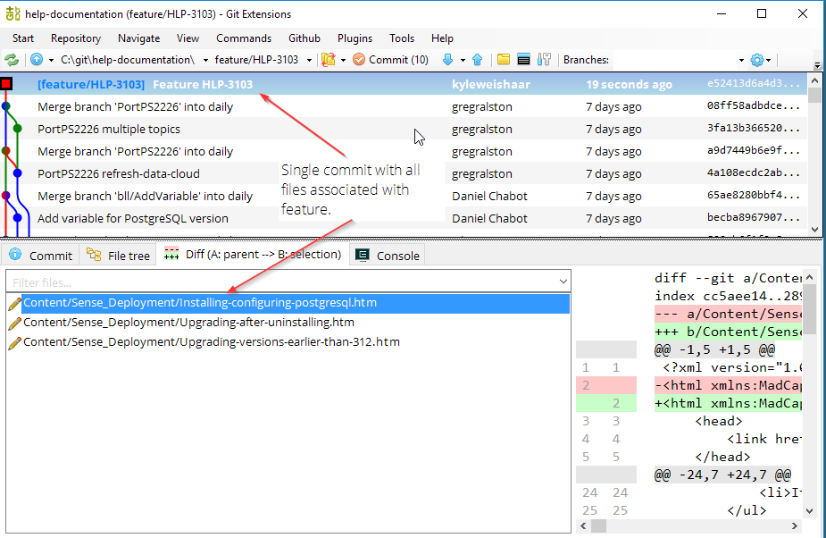

# Recover a deleted branch

If you forget to cherry-pick your feature to `master`, and you delete your branch, then you'll need to locate the commits on `daily`.

## Filter

The easiest way to find your commit is to use the filter option in Git Extension.



1. Select **Author**.

1. Enter your name exactly as it appear in the commit (name + email).

    `First Last <trigram@qlik.com>`

    For example:

    ```
    Author: First Last <trigram@qlik.com>
    Date: 19 hours ago (7/4/2018 4:08:57 PM)
    Commit hash: 3d79a92d56a9742d7dcc2963c554000894e401d4
    ```

After you enter the filter, you'll notice that the only commits you see in the graph are yours.



The branch I want to recover is `feature/HLP-3103`. I can look at the files associated with these commits clicking on a commit and looking at the **Commit** and **Diff** tabs.

I've found the commits that are associated with my deleted feature branch (in red).

## Create branch

I want to create a branch at the last commit that was merged into `daily`.

1. Right-click the commit.

1. Select **Create new branch**.

1. Name the branch with the correct feature name (example):

    feature/HLP-3103

1. Select **View** > **Show current branch only**.

    

!!! Note
    Now the graph is showing your recovered branch and only your commits.

## Reset files

1. Remove the author filter.

1. Find the parent of the first commit you did on this feature branch.

    In the image below, in red are the commits associated with the feature. In green is the parent of the earliest commit on my feature branch.

    

1. Right-clikc the parent commit.

1. select **Reset current branch to here**.

1. Leave the **Mixed** option.

You will notice that you have files in the commit dialog. Open the commit dialog. You will see some files in the working area. You will have a clean index.


You might see files not part of your feature. This is because other people have committed to `daily`, and these commits are parents of other commits in the new branch.

1. Select the files associated with the feature and stage them.

    They should be in the index.

1. Write a commit message: feature name.

1. Select **Commit**.

    

    At the top of the branch we now have a single commit associated with the feature.

    !!!Tip
        You still have to reset the files in the working area. Open the commit window and click 
        **Rest all changes**.

## Cherry-pick to `master`

1. Select **View** > **Show all branches**.

1. Checkout `master`.

1. Pull `master`.

1. Right-click the commit on your feature branch.

1. Select **Cherry-pick**.

1. Resolve conflicts if there are any.

## The result


Verify the content before deleting the local branch.

